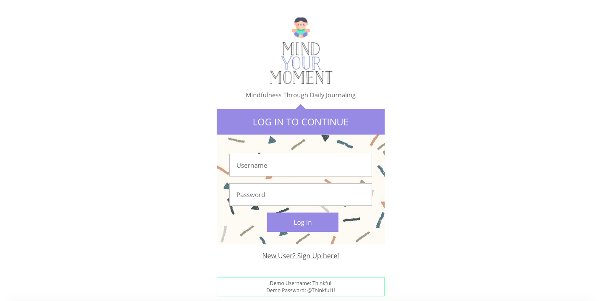
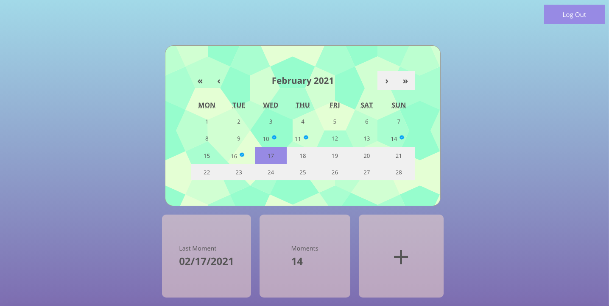
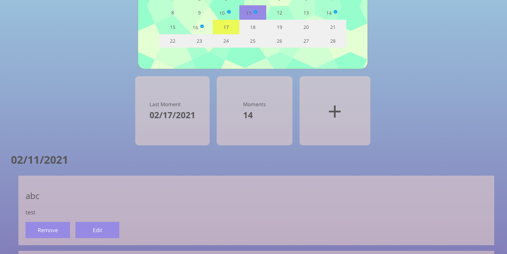

# Mind Your Moment

A minfulness app that helps you build a daily journaling habit.

Live : https://mindful.sailasantana.vercel.app/

# Features

* Calendar that stores your journal entries.
* Add an entry form
* Edit an entry form
* Add an unrecorded entry form (called 'Scream into the Void')


# Screenshots

## Landing (Login) page:



## Sign Up :


## Dashboard 

### Click on calendar dates associated with blue ticks to see past entries
### Click on + to add today's entry 




## Add An Entry 


## Edit An Entry 


# Environment Set Up

* Setup your own postgress server
* Run the sql scripts in migration folder to build your table structure. Server repo : https://github.com/sailasantana/journal-server
* Create a .env file in your server folder which contains the path to your database as well as a jwt secret
* Run your project with : ```npm run dev```


# Run Tests

* To run all tests, run : ```npm test```


# Built With

## Front-End
* React
* React Hooks 
* React-Router
* HTML5 and CSS3

## Back-End
* Nodejs
* PostgreSQL
* Knex.js
* Express.js

## Testing

* Supertest
* Chai
* Mocha
* Jest

